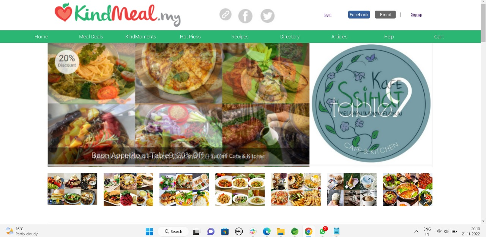
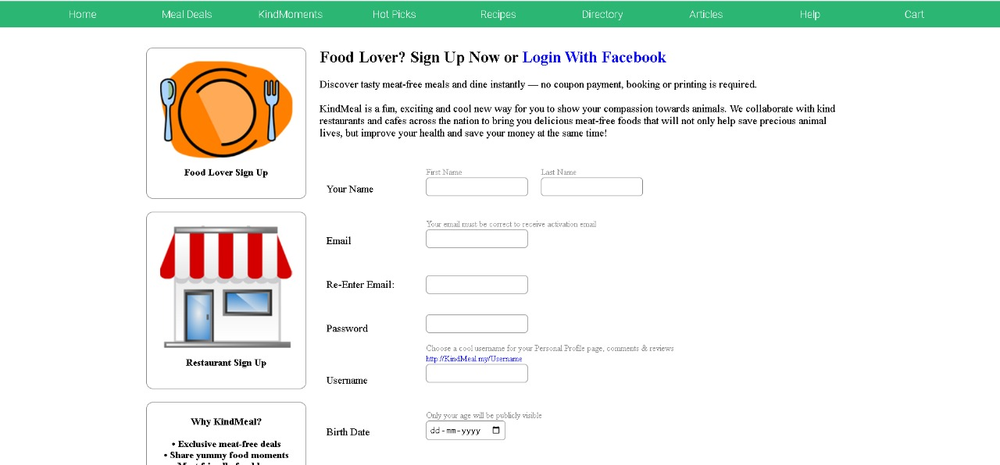
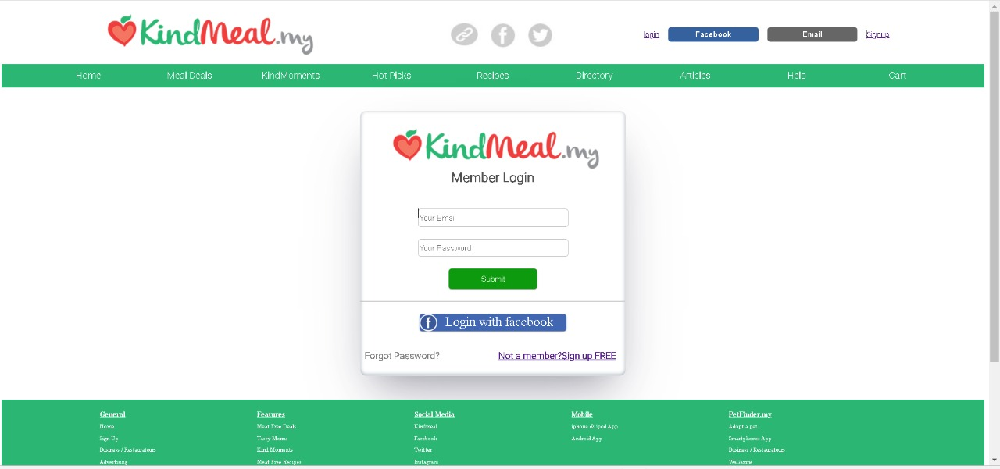

# aloof-observation-7622
 
 Kindmeal.com website was our project for Unit-3 Construct week at Masai School. We have made this project in 5 days.
Our clone kimdmeal website - 

# Tech Stack
 
-HTML -CSS -JAVA SCRIPT -GIT HUB

# Features

-Login and signin page. -Sorting for price. -Add to cart opt for adding items. -Increment and Decrement Number of product according to that price is also changes. -Discount price after applying coupon.

# Challenges we face during Construct week

On the first day we did't know about each other what is our weakness and what is our strong areas. So it was very difficult to assign right thing to right person.

Everyone's mind works differently and so ours. The website given to us. We changed some things in website. Everyone's idea was different. It is very difficult to choose one idea.

As the navbar and footer were common for all the pages so we copied both of them in a single folder and imported them in every code, this was a kind of new method for us and we struggled while doing this step.

Another challenge was to merge all of the files in a proper sequence which was again a difficult task for us because while merging and connecting all the pages some of the pages had the same name, and while running the site it was redirecting to some other pages so it was difficult to find the location and to rename the file.

We faced challenges with CSS tags and class also, because when we merged CSS files for any page in which 2-3 members have worked, sometimes tags were colliding because of the same names of tags and classes.

## Team
* Vedprakash
* Akshay Kadu
* Prashant shetti 
* Shivani Thakur
* Sumedh Ambhore
## Authors
* @Akshaykadu24

## Home Page

  

## SignUp Page

  

## Login Page

  

